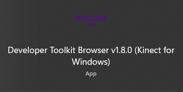
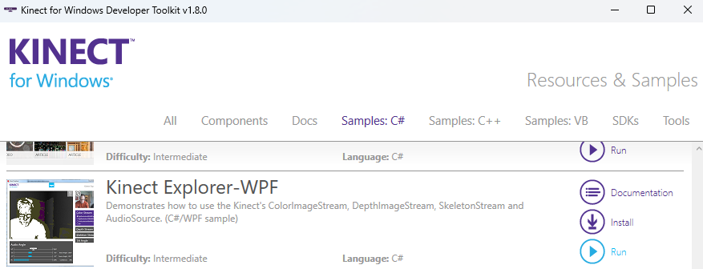
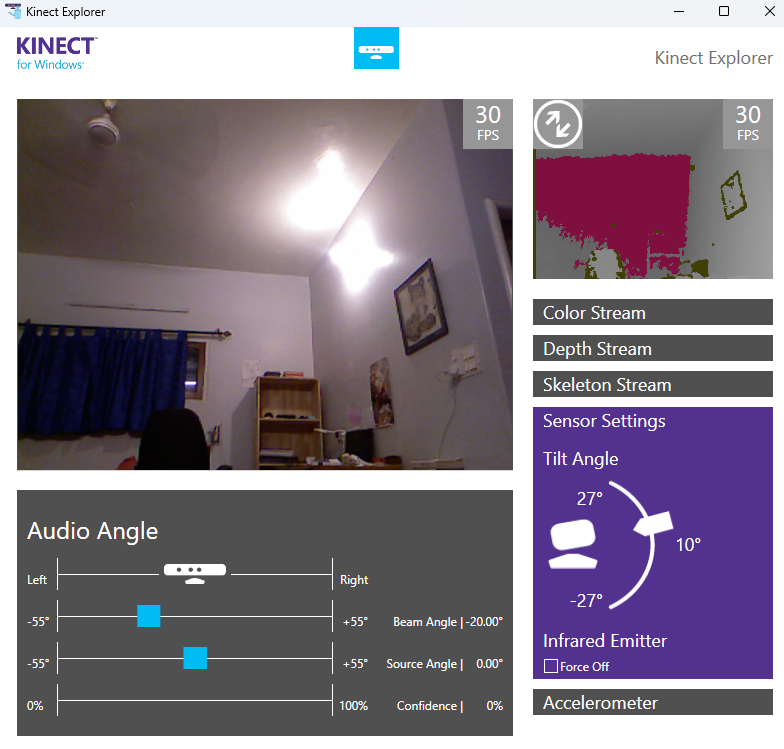
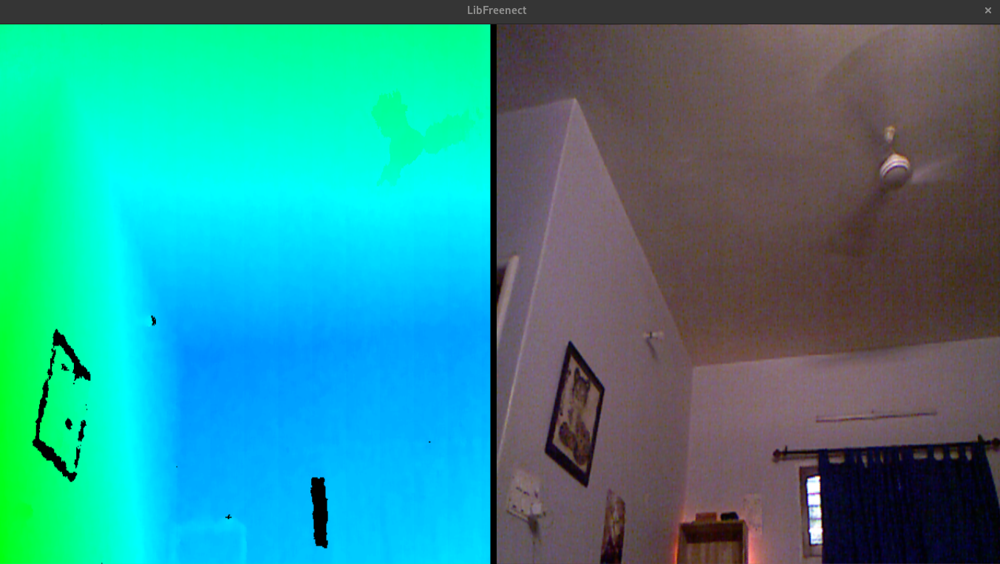
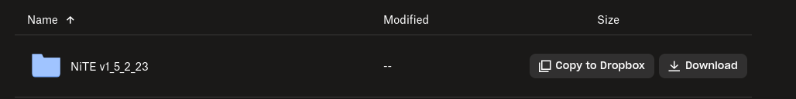
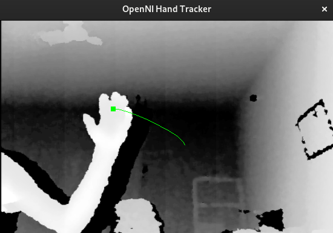
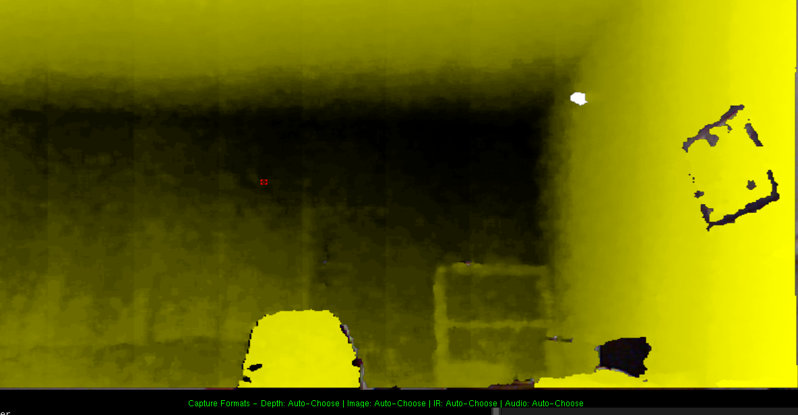
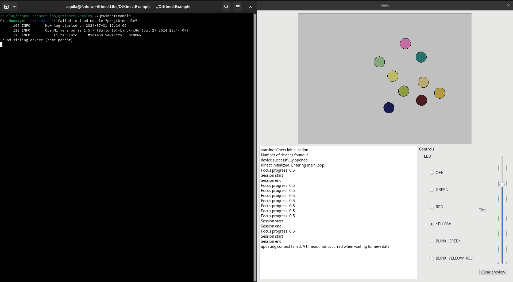

# Kinect on Fedora Linux

This guide walks through how to setup the Xbox Kinect Sensor on Fedora Linux. It also goes through building our own Qt application which uses the Kinect Sensor to detect a push gesture. I'm currently using Fedora 40 on my PC. 

This walkthrough has been inspired by the great guide by KDAB for setting up the Kinect on Ubuntu. You can check it out [here](https://www.kdab.com/setting-up-kinect-for-programming-in-linux-part-1/).

# Wiring

This [instructable](https://www.instructables.com/Wiring-an-Xbox-Kinect-for-USB/) explains how to wire the Xbox Kinect from its default adapter to a USB adapter.

# Test on Windows (Optional)

If you have a dual boot system with windows or a seperate system with windows, you can directly test the kinect with a few simple steps.

Testing kinect on windows is quite a straightforward process. You only need two software, the Kinect SDK and the Kinect Runtime. The important point is that the **driver and sdk versions must match**.

Install `Kinect for Windows Runtime v1.8` from [here](https://www.microsoft.com/en-us/download/details.aspx?id=40277) and the `Kinect for Windows SDK v1.8` from [here](https://www.microsoft.com/en-in/download/details.aspx?id=40278).

Reboot the system.

Launch `Kinect Browser`, and go to `Samples (C#)` and press `Run` on the `Kinect Explorer` sample. You will be able to see a window with the depth stream and various settings to control the kinect.

Program Name         | Browser
:-------------------------:|:-------------------------:
 | 

<br>

<p align="center">
    
</p>

# Device Recognition

The device should be recognized as having 3 sub devices on a bus:

```bash
aquila@fedora:~$ lsusb
Bus 001 Device 029: ID 045e:02b0 Microsoft Corp. Xbox NUI Motor
Bus 001 Device 066: ID 045e:02ad Microsoft Corp. Xbox NUI Audio
Bus 001 Device 067: ID 045e:02ae Microsoft Corp. Xbox NUI Camera
```

These devices have the following functions:
- Xbox NUI Motor: Handles the tilt engine and the status LED
- Xbox NUI Audio: Handles microphones array
- Xbox NUI Camera: Handle the cameras

In case the devices are not recognized the USB wire maybe faulty (which happened with me) or the wiring connections may not be tight / correct. Lastly, in a rare case the Linux Kernel drivers maybe missing for the kinect.
# Installation

## Required Software

We will be using the following libraries for these usecases:

1. **freenect** library: To control the LED and the tilt motor
   - [https://openkinect.org/](https://openkinect.org/)
   - [https://github.com/OpenKinect/libfreenect](https://github.com/OpenKinect/libfreenect)

2. **OpenNI** library: To control the video flux and get the depth map.
   - [http://openni.org/](http://openni.org/)
   - [https://github.com/OpenNI/OpenNI](https://github.com/OpenNI/OpenNI)

3. **Sensor Modules**: The official PrimeSense sensor modules are not compatible on Linux. Hence, we use a modified version:
   - [https://github.com/ph4m/SensorKinect](https://github.com/ph4m/SensorKinect) (This is a fork of [https://github.com/avin2/SensorKinect](https://github.com/avin2/SensorKinect) with necessary patches)

4. **NITE** (OpenNI compliant Middleware): A higher level library to get hand tracking, and predefined gestures without having to create the algorithms.
   - The OpenNI middleware binaries are not distributed officially anymore. After experimenting with a few sources for the library, ultimately I used a source available on this [Dropbox](https://www.dropbox.com/scl/fo/1slo8cg9mepod1tp7p0o8/AIdmMcb72lRTvUJegxuwrjc?rlkey=b2dmfvchcfkqoaf8t9rvelotr), based on an answer, [here](https://answers.ros.org/question/9737/openni_tracker-initfromxml-failed-cant-create-any-node-of-the-requested-type/) on the ROS forums.

**Note**: It is necessary that the OpenNI and NITE versions are the same. Here we have used version **1.5** for both.

## 1. Environment Setup

### I. Software

We will create a directory `KinectLibs` where all our software will be installed.

```bash
mkdir KinectLibs; cd KinectLibs
git clone https://github.com/OpenKinect/libfreenect # download the libraries
git clone https://github.com/OpenNI/OpenNI
git clone https://github.com/ph4m/SensorKinect
```

### II. Packages

The following packages must be installed to use the above libraries.

```bash
sudo dnf install make automake gcc gcc-c++ kernel-devel # equivalent to build-essential

sudo dnf install cmake pkg-config python freeglut-devel libXmu-devel libXi-devel libusb1-devel

sudo dnf install doxygen mono-complete graphviz # some more packages we need 
```

### III. Java Installation

OpenNI requires Java 6.0. However, Fedora repositories only features Java version above 8.0. Hence, we must directly obtain the JDK files from the [Java Downloads Archive](https://www.oracle.com/in/java/technologies/javase-java-archive-javase6-downloads.html). OpenNI recommends using the version `jdk-6u32-linux-i586-rpm.bin`.

```bash
# from the Downloads directory
chmod +x jdk-6u32-linux-i586-rpm.bin
sudo ./jdk-6u32-linux-i586-rpm.bin
sudo dnf install jdk-6u32-linux-i586.rpm
```

Now, `jdk-6.0` should be installed.

```bash
aquila@fedora:~/Downloads$ dnf list installed | grep jdk
copy-jdk-configs.noarch                              4.1-5.fc40                          @anaconda                       
java-21-openjdk-headless.x86_64                      1:21.0.4.0.7-2.fc40                 @updates                        
jdk.i586                                             2000:1.6.0_32-fcs                   @System
```

## 2. OpenKinect (libfreenect) Installation

```bash
# in libfreenect directory
mkdir build
cd build
cmake ..
make
sudo make install
sudo ldconfig /usr/local/lib64/
```

Set the read / write permissions for the camera and motor devices:

```bash
sudo chmod a+rw /dev/bus/usb/<xbox_bus_no>/<xbox_camera_no>
sudo chmod a+rw /dev/bus/usb/<xbox_bus_no>/<xbox_motor_no>
```

Test the sensor using `glview`:

```bash
cd build/bin
./freenect-glview
```

<p align="center">
    
</p>

Try playing around with the different modes:

```
'w' - tilt up, 's' - level, 'x' - tilt down, '0'-'6' - select LED mode, '+' & '-' - change IR intensity 
'f' - change video format, 'm' - mirror video, 'o' - rotate video with accelerometer 
'e' - auto exposure, 'b' - white balance, 'r' - raw color, 'n' - near mode (K4W only)
```

In case you have any issues, refer to the [OpenKinect FAQ](https://openkinect.org/wiki/FAQ).

**Note**: This guide currently does not feature how to utilize the Audio sensors on the kinect. This is possible by uploading audio firmware to the kinect. This [answer](https://gamedev.stackexchange.com/a/153999) on gamedev.stackexchange.com may be a helpful starting point.

If you've reached this point, it should be enough to start and experimenting with your kinect. OpenNI and NITE just give us an easier way to interface with our kinect with high level libraries and write our own apps using gesture recognition etc.
## 3. SensorKinect Installation

Install the sensor modules as follows:

```bash
# Inside the SensorKinect directory
cd Platform/Linux/CreateRedist
chmod +x ./RedistMaker
./RedistMaker
```

Some of the issues I faced while installing SensorKinect:

> **Cannot recognize linker parameter `XnDDK`**:
> The install script is unable to find `libXnDDK.so`.
> 
> Method 1: Go to `Platform/Linux/Build/` and run `make`. Now rerun `RedistMaker`
>    
> Method 2: If the above solution does not work try this method. Go to the `bin` directory in the **root** of our `SensorKinect` directory and run:
> 
> ```bash
> aquila@fedora:~/KinectLibs/SensorKinect$ cd Bin
> aquila@fedora:~/KinectLibs/SensorKinect/Bin$ tar -xvjf SensorKinect093-Bin-Linux-x64-v5.1.2.1.tar.bz2
> ```
> 
> Try running `RedistMaker` again. If it gives the same error again you may have to run the `install.sh` file inside the directory which we extracted above.

Once `RedistMaker` runs successfully, now run:

```bash
cd ../Redist/Sensor-Bin-Linux-x64-v5.1.2.1/
sudo ./install.sh
```

## 4. OpenNI Installation

> Note, by default `python` may bind to `python3` on your system. 
> 
> ```bash
> aquila@fedora:~$ python
> Python 3.12.4 (main, Jun  7 2024, 00:00:00)
> ```
> 
> If so, edit `RedistMaker` using any text editor, and replace `python` with `python2`:
> ```bash
> nano RedistMaker
> ```

As of writing this guide, the sample `NiViewer` gives compilation errors when running `make` due to a symbol conflict with the standard library. Copy the contents of `glh_linear.h` from [here](https://github.com/EmaroLab/OpenNI/blob/99e5dcc60860ea065bad3afaefb4c4cf7bc98e18/Samples/NiViewer/glh/glh_linear.h) and replace it in `Samples/NiViewer/glh/glh_linear.h`:

```bash
# from OpenNI root directory
cd Samples/NiViewer/glh
nano glh_linear.h
```

Now we can run `RedistMaker`:

```bash
# Inside the OpenNI directory
cd Platform/Linux/CreateRedist
chmod +x ./RedistMaker
./RedistMaker
```

The hard part of OpenNI's installation is to get `make` to run without any errors.

Once `RedistMaker` runs successfully, now run:

```bash
cd ../Redist/OpenNI-Bin-Dev-Linux-x64-v1.5.7.10/
sudo niLicense -l 0KOIk2JeIBYClPWVnMoRKn5cdY4= # Register the free OpenNI license so that our Sample binaries work properly
sudo ./install.sh
```

The Sample binaries in OpenNI will not work yet, since we do not have NITE installed.

## 5. NITE (OpenNI Middleware) Installation

### Install NITE

Download NITE version 1.5.2 from the Dropbox link mentioned in the [Required Software](#required-software) section and extract the `.zip` file.

<p align="center">
    
</p>

We have installed the `x64` version of OpenNI. So we need the libraries for NITE to be installed to `/usr/lib64` instead of `/usr/lib`. We can do this by replacing all occurrences of `/usr/lib` with `/usr/lib64` using any text editor.

```bash
nano install.sh
```

### NITE Samples

After the installation runs successfully, we can test the NITE sample:

```bash
cd Samples/Bin/x64-Release
./Sample-Players
```

This should launch a window. When a person is in front of the sensor it will highlight them. With more persons it shows other colors for each person.

Now the possibilties are endless! Try running the various samples.

https://github.com/user-attachments/assets/61c1b690-f369-4364-943c-526c0ffd6ace

> **Sample-Boxes**
> 
> - move your hand left<->right (quickly) in front of the sensor until the green sliders appears on screen, you now control the slider with your hand, the cubes are zones.
> 
> **Sample-CircleControl**
> 
> - move your hand left<->right (quickly) in front of the sensor until the window gets a green frame, then make circles with your hand, you now control the spoke.
> 
> **Sample-Players**
> 
> - for this one, it’s better if the kinect see your entire body. Get in front of the kinect, you will turn blue, ask some friends to come, they will be detected as well (different colors). Then put your hands up, the kinect now tracks your skeleton. It seems to work only for one player though.
> 
> **Sample-PointServer**
> 
> - not sure about this one, it seems to be a handTracker, in a separate thread.
> 
> **Sample-PointViewer**
> 
> - move your hand left<->right (quickly) or click (push your screen) in front of the sensor until your hand gets tracked.
> 
> **Sample-SceneAnalysis**
> 
> - seems similar to Sample-Players, without skeleton tracking
> 
> **Sample-SingleControl**
> 
> - hold your hand steady in front of the Kinect then gently push forward and come back, you’ll get hand points and gesture tracking in debug output (no openGL fancyness this time)
> 
> **Sample-TrackPad**
> 
> - move your hand left<->right (quickly) or click (push your screen), once you get the focus, move your hand around, squares get selected according to the hand position.

### OpenNI Samples

We can also run our OpenNI samples now:

```bash
aquila@fedora:~/KinectLibs/OpenNI$ cd Platform/Linux/Bin/x64-Release/
aquila@fedora:~/KinectLibs/OpenNI/Platform/Linux/Bin/x64-Release$ ./Sample-NiHandTracker
```

<p align="center">
    
</p>

Trying out `NiViewer`:

```bash
aquila@fedora:~/KinectLibs/OpenNI/Platform/Linux/Bin/x64-Release$ ./Sample-NiViewer
```

A depth stream of the scene:

<p align="center">
    
</p>

We have successfully setup our Kinect on Fedora! (give yourself a pat on the back). Next lets create an application to implement our own ideas to use with the Kinect sensor.

# Qt Application

Now that we have our Kinect up and running, we can run our own code to interface with the Kinect and do some interesting stuff.

This guide is based on the [guide](https://www.kdab.com/setting-up-kinect-for-programming-in-linux-part-2/) by KDAB on running a Qt Application which records a 'push' gesture from our hand. The guide also explains the code so you can write your own applications for the Kinect.

## Overview

https://github.com/user-attachments/assets/01888417-5334-433a-8910-f2b72cde9a60

> - The grey rectangle on the top of the window is a representation of the Kinect scene.
> - The white rectangle represents your hand, it has a label attached showing it’s current coordinates. _shake your hand in front of the Kinect for it to be recognized_
> - Every time you’ll  “push”, a (randomly colored) circle will appear where your hand is.
> - The bottom left panel shows messages generated by the different libraries.
> - The bottom right panel allow you to modify the current physical state of the Kinect (switch the led, tilt the head)
> - You can reset the view (remove colored circles) by clicking on the “clear preview” button

## Requirements

### libusb Permissions

If you get an error like that: `libusb couldn’t open USB device /dev/bus/usb/001/006: Permission denied.` follow the following procedure (found [here](http://openkinect.org/wiki/Getting_Started)):

```bash
sudo adduser $USER video
sudo nano /etc/udev/rules.d/51-kinect.rules
```

then copy the following lines in the file:

```
# ATTR{product}=="Xbox NUI Motor" SUBSYSTEM=="usb", ATTR{idVendor}=="045e", ATTR{idProduct}=="02b0", MODE="0666"
# ATTR{product}=="Xbox NUI Audio" SUBSYSTEM=="usb", ATTR{idVendor}=="045e", ATTR{idProduct}=="02ad", MODE="0666"
# ATTR{product}=="Xbox NUI Camera" SUBSYSTEM=="usb", ATTR{idVendor}=="045e", ATTR{idProduct}=="02ae", MODE="0666"
```

Be sure to log out and back in.

### Qt Installation

Install qt-4 with the command:

```bash
sudo dnf install qt-devel # ensure that it is qt-4
```

Now, test `qmake-qt4`:

```bash
aquila@fedora:~$ qmake-qt4 
Usage: qmake-qt4 [mode] [options] [files]
```

## How to Build

### Getting the Source Code

Download the demo application source code from [here](http://www.kdab.com/wp-content/uploads/stories/QtKinectExample.tar.gz) to our `~/KinectLibs` folder which we used during our installation. Extract the `.tar.gz` file to the same folder. 

Now go to the extracted folder:

```bash
aquila@fedora:~/KinectLibs$ cd QtKinectExample
```

### Building

Replace the contents of `QtKinectExample.pro` with the following content. Replace the include and library directories to the relevant paths in your system:

```
TEMPLATE = app
TARGET = 
DEPENDPATH += .

LIBS += -L/home/aquila/KinectLibs/OpenNI/Platform/Linux/Bin/x64-Release -lOpenNI
LIBS += -L/home/aquila/KinectLibs/NITE-Bin-Dev-Linux-x64-v1.5.2.23/Bin -lXnVNite_1_5_2
LIBS += -L/home/aquila/KinectLibs/libfreenect/build/lib -lfreenect

INCLUDEPATH += .
INCLUDEPATH += /home/aquila/KinectLibs/OpenNI/Include/ 
INCLUDEPATH += /home/aquila/KinectLibs/NITE-Bin-Dev-Linux-x64-v1.5.2.23/Include
INCLUDEPATH += /home/aquila/KinectLibs/libfreenect/include

# Input
HEADERS += callBacks.h QtKinect.h QtKinect_global.h QtKinectExample.h
FORMS += QtKinectExample.ui
SOURCES += main.cpp QtKinect.cpp QtKinectExample.cpp
RESOURCES += res.qrc
```

Now build the application:

```bash
aquila@fedora:~/KinectLibs/QtKinectExample$ qmake-qt4
aquila@fedora:~/KinectLibs/QtKinectExample$ make
```

# Running the Application

We can run our application with the following command:

```bash
aquila@fedora:~/KinectLibs/QtKinectExample$ ./QtKinectExample
```

Now, the application should launch. Follow the [Overview](#overview) to play around with the application.

<p align="center">
    
</p>

# Conclusion

This was an exciting (and long!) ride on getting the kinect to work on Fedora. Hopefully, you were able to follow along.

This should be enough to get your hands dirty and create your own super-cool applications with the Kinect (●'◡'●)